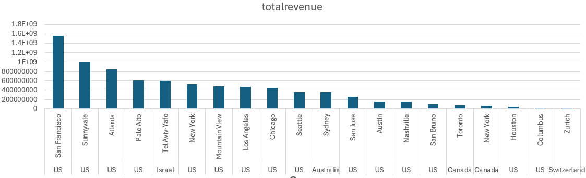
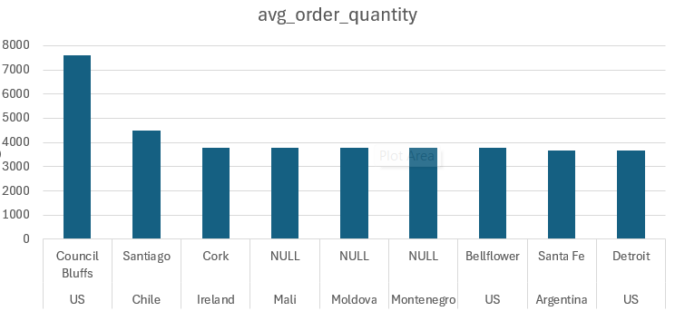
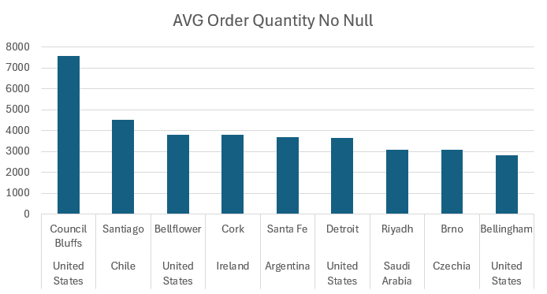

Answer the following questions and provide the SQL queries used to find the answer.

    
**Question 1: Which cities and countries have the highest level of transaction revenues on the site?**


SQL Queries:
```
SELECT 
	country, 
	city,
	SUM(totaltransactionrevenue) AS totalrevenue
FROM all_sessions
WHERE totaltransactionrevenue != 0
AND city IS NOT NULL
AND country IS NOT NULL
GROUP BY
	country, 
	city
ORDER BY totalrevenue DESC;
```

Answer:	
	
	As shown the majority of the top cities are within the U.S, with Isreal's capital taking the 5th spot.

**Question 2: What is the average number of products ordered from visitors in each city and country?**


SQL Queries:
-- Joined the 3 tables which have order quantities and their SKU/name
```
WITH product_order_CTE AS (
	SELECT
		product_sku,
		sales_report.name,
		orderquantity,
		sales_report.totalordered
	FROM sales_by_sku
	JOIN sales_report USING (product_sku)
	JOIN products USING (product_sku)
)
```
-- calculting avg order quantities per city and country
```
SELECT
	country,
	city,
	AVG(orderquantity) AS avg_order_quantity
FROM all_sessions
JOIN product_order_CTE USING(product_sku)
GROUP BY 
	country,
	city
ORDER BY avg_order_quantity DESC;
```
-- Checking to see if identitical order quantities are causing avg_order_quantity in rows 2-8 to be the same
```
SELECT
    country,
    city,
    AVG(orderquantity) AS avg_order_quantity,
    MIN(orderquantity) AS min_order_quantity,
    MAX(orderquantity) AS max_order_quantity,
    COUNT(*) AS row_count
FROM all_sessions
JOIN product_order_CTE USING (product_sku)
GROUP BY country, city
ORDER BY avg_order_quantity DESC, country, city;
```

-- Attempting to deal with potential duplicate when calculating avg_order_quantity
```
WITH product_order_CTE AS (
	SELECT DISTINCT
		product_sku,
		sales_report.name,
		orderquantity,
		sales_report.totalordered
	FROM sales_by_sku
	JOIN sales_report USING (product_sku)
	JOIN products USING (product_sku)
)
SELECT
    country,
    city,
    AVG(orderquantity) AS avg_order_quantity,
    MIN(orderquantity) AS min_order_quantity,
    MAX(orderquantity) AS max_order_quantity,
    COUNT(*) AS row_count
FROM all_sessions
JOIN product_order_CTE USING (product_sku)
GROUP BY country, city
ORDER BY avg_order_quantity DESC, country, city;
```
-- Looking into how many values are contributing to the avg_order_quantity (allowing NULL cities)
```
SELECT
	country,
	city,
	AVG(orderquantity) AS avg_order_quantity,
	COUNT(*) AS row_count
FROM all_sessions
JOIN product_order_CTE USING (product_sku)
GROUP BY 
	country,
	city
ORDER BY avg_order_quantity DESC, country, city;
```
-- looking into average without allowing NULL cities
```
SELECT
	country,
	city,
	AVG(orderquantity) AS avg_order_quantity
FROM all_sessions
JOIN product_order_CTE USING(product_sku)
WHERE city IS NOT NULL
GROUP BY 
	country,
	city
ORDER BY avg_order_quantity DESC;
```

---

Answer:  
Ranking top 10 order quantity averages with NULL cities  
  

If we only look at countries allowing for city values to be NULL, Mali, Moldova,  
and Montenegro carve a spot for themselves.

---

Top 10 without NULL cities  
  

When looking at average order quantities by country and city, the list becomes more diverse.  
Aside from the U.S., we see Chile, Ireland, Argentina, Saudi Arabia, and Czechia make the list.

---


**Question 3: Is there any pattern in the types (product categories) of products ordered from visitors in each city and country?**


SQL Queries:
```
WITH product_order_CTE AS (
	SELECT
		product_sku,
		sales_report.name,
		orderquantity,
		sales_report.totalordered
	FROM sales_by_sku
	JOIN sales_report USING (product_sku)
	JOIN products USING (product_sku)
)

SELECT 
    country,
    city,
    v2productcategory,
    name,
    v2productname,
    SUM(orderquantity) AS total_quantity_ordered
FROM all_sessions
JOIN product_order_CTE USING (product_sku)
WHERE 
    country IS NOT NULL 
    AND city IS NOT NULL
    AND name IS NOT NULL 
    AND v2productname IS NOT NULL -- Exclude null values for name and v2productname
GROUP BY 
    country,
    city,
    v2productcategory,
    name,
    v2productname
ORDER BY 
    country, 
    city, 
    total_quantity_ordered DESC;
```
-- refining to only show top result for each country and city
```
WITH product_order_CTE AS (
    SELECT
        product_sku,
        sales_report.name,
        orderquantity,
        sales_report.totalordered
    FROM sales_by_sku
    JOIN sales_report USING (product_sku)
    JOIN products USING (product_sku)
)

SELECT DISTINCT ON (country, city) -- Use DISTINCT ON to fetch the top result for each country and city
    country,
    city,
    v2productcategory,
    name,
    v2productname,
    SUM(orderquantity) AS total_quantity_ordered
FROM all_sessions
JOIN product_order_CTE USING (product_sku)
WHERE 
    country IS NOT NULL 
    AND city IS NOT NULL
    AND name IS NOT NULL 
    AND v2productname IS NOT NULL -- Exclude null values for name and v2productname
GROUP BY 
    country,
    city,
    v2productcategory,
    name,
    v2productname
ORDER BY 
    country, 
    city, 
    total_quantity_ordered DESC;
```


Answer:
The most popular product varies significantly by location. In cities like Buenos Aires and Santa Fe in Argentina, home products dominate, 
particularly lifestyle items. In the United States, items like the Nest® Cam Outdoor Security Camera and Nest® Cam Indoor Security Camera 
are leading in popularity, reflecting a strong emphasis on home security.

Overall Most Popular Products:
The Google Kick Ball, categorized under "Home/Accessories/Fun," emerges as a top favorite globally, suggesting a shared interest in recreational items.
YouTube Custom Decals also rank highly, indicating a demand for branded merchandise and the influence of brand ambassadors.
Category Trends:
"Home/Nest/Nest-USA" dominates in the United States, aligning with the country's unique focus on high-tech home security solutions.
Products categorized under "Accessories" and "Sports & Fitness" show widespread appeal, with substantial quantities ordered across diverse regions.


**Question 4: What is the top-selling product from each city/country? Can we find any pattern worthy of noting in the products sold?**


SQL Queries:
```
WITH product_order_CTE AS (
	SELECT
		product_sku,
		sales_report.name AS product_name,
		orderquantity,
		sales_report.totalordered
	FROM sales_by_sku
	JOIN sales_report USING (product_sku)
	JOIN products USING (product_sku)
),
sales_data AS (
	SELECT 
		country,
		city,
		v2productcategory,
		product_name,
		SUM(orderquantity) AS total_quantity_ordered
	FROM all_sessions
	JOIN product_order_CTE USING (product_sku)
	WHERE 
		(country IS NOT NULL AND city IS NOT NULL) -- Ensure valid country and city
		AND (v2productname IS NOT NULL AND v2productcategory IS NOT NULL) -- Ensure valid product data
	GROUP BY 
		country,
		city,
		v2productcategory,
		product_name
),
ranked_sales AS (
	SELECT 
		country,
		city,
		v2productcategory,
		product_name,
		total_quantity_ordered,
		RANK() OVER (PARTITION BY country, city ORDER BY total_quantity_ordered DESC) AS rank
	FROM sales_data
)
SELECT 
	country,
	city,
	v2productcategory,
	product_name,
	total_quantity_ordered
FROM ranked_sales
WHERE rank = 1 -- Get the top-selling product for each city/country
ORDER BY 
	total_quantity_ordered
```
-- Ordered by country and city for countries instead of total quantity
```
SELECT 
	country,
	city,
	v2productcategory,
	product_name,
	total_quantity_ordered
FROM ranked_sales
WHERE rank = 1 -- Get the top-selling product for each city/country
ORDER BY 
	country,
	city
```

Answer:
	When looking at the the top products by order quantity, the indoor security camera takes
	the top spot in the U.S and for multiple cities, Mountainview, Palo Alto, Sunnvale, and
	San Franscisco. For India, Singapore, Mexico, Brazil, and Isreal the top product was
	a water bottle. Given how each of these countries were distinct rows yet the quantity shown
	was identitical for them. I would assume they would sold as bundles.


**Question 5: Can we summarize the impact of revenue generated from each city/country?**

SQL Queries:
```
SELECT
	country,
	city,
	v2productcategory,
	v2productname,
	totaltransactionrevenue
FROM all_sessions
WHERE totaltransactionrevenue != 0
AND city IS NOT NULL
ORDER BY totaltransactionrevenue DESC
```


Answer: 
	Removing NULL values from the city column, one distinction we can draw is that our revenue is primarily 
	from the U.S. 


